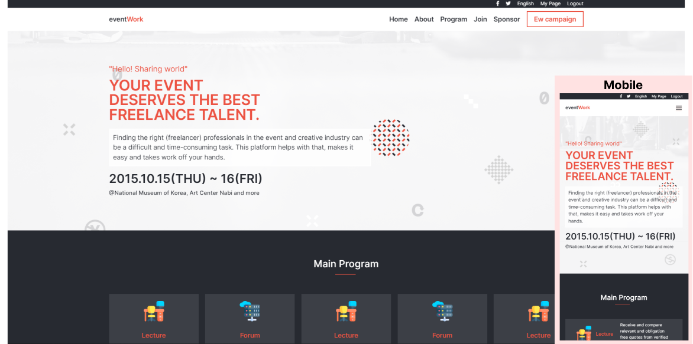

# EventWork Platform

This project is an event platform where people can get everything about hosting an event, eg. Freelancer, decorations,etc. This project is the result a my Capstone project 1

## Built With

- Html
- Css
- JavaScript

### Home page

### Login pop up

## Live Demo

[Live Demo Link](https://barakadanny.github.io/capstone-project-1/)

## Getting Started

To run this project clone it with `git clone https://github.com/barakadanny/capstone-project-1.git`
then run from a browser

To get a local copy up and running follow these simple example steps.

### Prerequisites

- Browser eg. Chrome
- Text Editor eg. Vs Code, Atom, Sublime text, etc.

### Install

Install linters to handle some common Errors, You can have description about [Linters here](https://github.com/microverseinc/linters-config)

👤 **Baraka Danny**

- GitHub: [@barakadan](https://github.com/barakadanny)
- LinkedIn: [danny baraka](https://www.linkedin.com/in/danny-baraka-589156169/)

## Credit

[@Cindy Shin](https://www.behance.net/adagio07) Thanks for this amazing design

## 🤝 Contributing

Contributions, issues, and feature requests are welcome!

Feel free to check the [issues page](https://github.com/barakadanny/capstone-project-1/issues).

## Show your support

Give a ⭐️ if you like this project!

## Acknowledgments

- Hat tip to anyone whose code was used
- Inspiration
- etc

## 📝 License

This project is [MIT](./MIT.md) licensed.
